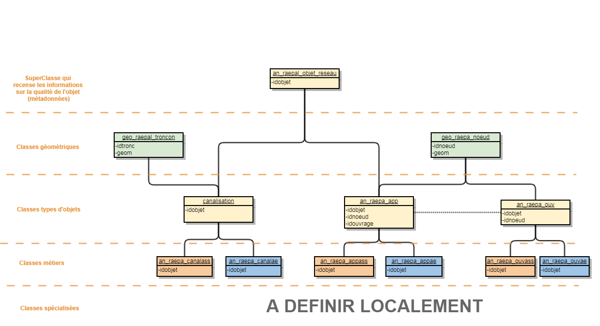

# Principes

Dans le cadre du projet sur les réseaux d'Eau et d'Assainissement ainsi que du standard national RAEPA, la collectivité souhaite prendre connaissance du patrimoine de ces réseaux à l'échelle du territoire auprès de ces concessionnaires auxquels elle délègue la compétence. 
En appui du standard national existant et des standards régionaux, l'objectif est de mettre en place une base de données étendue du standard national RAEPA, dans une logique de rendre la modélisation accessible pour tous types de réseaux.

Cette base de données a été conçue, au travers des échanges réguliers avec nos services métiers, ainsi que nos concessionnaires sur notre territoire.

# Étapes de modélisation

La première étape de ce projet est de s'orienter sur la modélisation des informations patrimoniales de ces réseaux, avant de se pencher sur les aspects des interventions, contextuels, d'habillages ou encore de gestion.

## Architecture de base
Après analyses et mise en place d'un diagnostic entre les différents standards (national et locaux) ainsi que des expériences du service sur d'autres projets de réseaux, l'architecture des classes a été définie dans un premier temps afin de stocker les informations patrimoniales des réseaux.

### Cardinalités

|TABLE DEPART|DEPART|TABLE DESTINATION|ARRIVE|
|:---|:-|:---|:-|
|an_raepal_objet_reseau|(0,1)|an_raepa_canal|(1,1)|
|an_raepal_objet_reseau|(0,1)|an_raepa_app|(1,1)|
|an_raepal_objet_reseau|(0,1)|an_raepa_ouv|(1,1)|
|geo_raepal_troncon|(0,1)|an_raepa_canal|(1,1)|
|geo_raepa_noeud|(0,N)|an_raepa_app|(1,1)|
|geo_raepa_noeud|(0,1)|an_raepa_ouv|(1,1)|
|geo_raepa_noeud|(0,1)|an_raepa_app|(1,1)|
|an_raepa_canal|(0,1)|an_raepa_canalass|(1,1)|
|an_raepa_canal|(0,1)|an_raepa_canalae|(1,1)|
|an_raepa_app|(0,1)|an_raepa_ouv|(0,1)|
|an_raepa_app|(0,1)|an_raepa_appass|(1,1)|
|an_raepa_app|(0,1)|an_raepa_appae|(1,1)|
|an_raepa_ouv|(0,1)|an_raepa_ouvass|(1,1)|
|an_raepa_ouv|(0,1)|an_raepa_ouvae|(1,1)|

Remarque : Concernant la table geo_raepal_troncon, la cardinalité de départ est de 0,1. En effet, En prenant en compte la disponibilité de cette modélisation pour tous réseaux, on peut imaginer greffer ultérieurement les écoulements de surfaces, ou encore les réseaux éléctriques. Le tronçon sera donc rattaché à l'un des réseau et non uniquement pour une canalisation.

# Dépendances

La base de données RAEPA s'appuie sur des référentiels préexistants constituant autant de dépendances que nécessaires pour l'implémentation de certaines informations dans la BdD.

|SCHEMA|TABLE/VUE|DESCRIPTION|USAGE|
|:---|:---|:---|:---|
|A COMPLETER||| Détermine le code INSEE des objets du réseau par jointure spatiale. |
|A COMPLETER|||Détermine le domaine Privée ou Public de l'objet du réseau par rapport au référentiel cadastral. |
|A COMPLETER|||Détermine l'adresse de localisation de l'objet à partir de jointure spatiale du référentiel des voies et adresses. |

# Séquences

De façon général, nous avons entendu la création d'une séquence pour les objets du réseau, quelqu'il soit, ainsi que la génération d'une séquence pour chaque compléments d'informations. Il a été convenu que les géométries sont des informations complémentaires au patrimoine du réseau. Par conséquent, nous générerons 3 séquences : 

* raepa_id_obj_reseau_seq : Séquence permettant de générer un numéro unique pour un objet de réseau.
* raepa_id_noeud_seq : Séquence permettant de générer un numéro unique par noeud de réseau.
* raepap_id_tronc_seq : Séquence permettant de générer un numéro unique par tronçon de réseau.

En conséquence, ces choix permettent de pouvoir identifier un objet de réseau, quelque soit ce réseau, de manière unique. Nous aurions très bien pu générer une séquence par réseau ou encore par type d'objet, ou encore de manière combinée, mais cela aurait pour conséquence des doublons d'identifiants dans la superclasse d'objets de réseau, évoquée ci-après.

# Collecte du patrimoine

Afin de pouvoir identifier les informations qui sont issues du standard national ou des extensions locales, nous utiliserons la codification suivante :

* Nomenclature des classes : raepa_[nom_classe] pour les informations issues du RAEPA et raepal_[nom_classe] pour les informations issues d'extension locale
* Nomenclature des attributs : Ajout du préfixe "l_" devant chaque attribut issus de l'extension locale.

## Adaptation de contenu du standard RAEPA

Au cours de notre analyse, nous avons observé un certains nombre d'anomalies du standard, ou de manque de richesse de certaines listes de valeurs. Nous avons alors adapté celles-ci selon nos propres besoins. Ces évolutions sont décrites ci-dessous :

|attribut/liste|adaptation|
|:----|:----|
|materiau| Attribut déplacé à la superclasse an_raepal_objet_reseau. Extension de la liste de domaines|
|enservice| Extension de cet attribut pour les ouvrages et appareillages. Déplacé à la superclasse an_raepal_objet_reseau.|
|andebpose/anfinpose|Décision de la définition comme tel : Date de début (ou fin) de pose de l'objet du réseau. Choix réalisé suite à la définition différente entre une canalisation et un appareille ou ouvrage.|
|sensecoul|Extension de l'attribut pour les canalisation d'AEP également. Attribut déplacé à la classe géométrique geo_raepal_tronc.Utilisation d'une liste de domaine pour être en cohérence avec des proejts déjà réalisés par le service.|
|longcana|Attribut renommé en "longmes".|
|idnini/idnterm| Attributs déplacés à la classe géométrique geo_raepal_tronc.|
|zamont/zaval|Décision de la précision de la définition. Ces attributs correspondront donc à l'altitude fil d'eau. Attributs déplacés sur an_raepa_canal pour tout type de réseau d'eau (non uniquement pour ASS).|
|profgen|Attribut renommé pour "distgen", permettant d'être cohérent en cas de canalisation suspendue (distance et non profondeur). Attribut déplacé sur an_raepa_canal pour tout type de réseau d'eau (non uniquement pour AEP).|
|z|Attributs renommé respectivement par "zradapp" et "zradouv" pour les ouvrages et appareillages. Précision de la définition : correspond à l'altitude radier.|
|fnouvass| Extension de la liste de valeurs.|
|fnouvaep| Extension de la liste de valeurs.|
|contcanaep|Extension de la liste de valeurs.|

## Définition des classes
`geo_raepal_comparateur` : Classe d'indicateur stockant les ajouts et suppressions d'objets entre deux versions d'intégration (rappel : délégation de compétence, nous ne produisons pas les données.

|Nom attribut|Définition|Type|Contrainte|Valeurs|
|:---|:---|:---|:---|:---|
|idobjet|Identifiant unique de l'objet du réseau.|bigint|Primary Key|nextval('m_raepa.raepa_id_obj_reseau_seq'::regclass)|
|idprod|Identifiant du producteur de l'objet|character varying  (254).|Obligatoire||
|reseau|Réseau concerné|character varying  (7)|Obligatoire||
|typcomp| Type de comparaison (ajout/suppression)|character varying (20)|Obligatoire||
|typeobjet|Type d'objet du réseau|character varying (20)|Obligatoire||
|concess| Définit le concessionnaire de l'objet|character varying (20)|Obligatoire||
|date_liv|date de livraison du jeu de données|date|Obligatoire||
|geom| Geometry|GEOMETRY, 2154|Obligatoire||

### Niveau 0 - Superclasse Objet de Réseau
`an_raepal_objet_reseau` : Superclasse regroupant les informations communes à tous types d'objet du réseau

|Nom attribut|Définition|Type|Contrainte|Valeurs|
|:---|:---|:---|:---|:---|
|idobjet|Identifiant unique de l'objet du réseau.|bigint|Primary Key|nextval('m_raepa.raepa_id_obj_reseau_seq'::regclass)|
|idprod|Identifiant du producteur de l'objet|character varying  (254).|Obligatoire||
|l_insee|Code INSEE de la commune de localisation de l'objet du réseau.|character varying  (5)|Obligatoire||
|l_positver|Position verticale de l'objet de réseau|character varying (2)||lt_raepal_positver|
|materiau|Matériau constitutif de l'objet du réseau.|character varying  (5)|Obligatoire|lt_raepal_materiau|
|mouvrage|Maître d'ouvrage du réseau.|character varying  (100)|Obligatoire||
|gexploit|Gestionnaire exploitant du réseau.|character varying  (100)|Obligatoire||
|andebpose|Année marquant le début de pose de l'objet de réseau.|character varying  (4)|||
|anfinpose|Année marquant la fin de pose de l'objet de réseau.|character varying  (4)|||
|l_entrpose|Entreprise ayant réalisée la pose de l'objet de réseau.|character varying  (100)|||
|l_marque|Marque commerciale de l'objet|character varying (100)|||
|l_modele|Modèle de l'objet|character varying (100)|||
|enservice|Objet en service ou non (abandonné).|character varying  (1)||O,N|
|l_etat|Etat de l'objet.|character varying  (2)||lt_raepal_etat|
|l_criticit|Objet en criticité ou non.|character varying  (1)||lt_raepal_boolean|
|l_domaine|Domaine auquel appartient l'objet du réseau.|character varying  (2)||lt_raepal_domaine|
|l_libvoie|Adressage du nom de la rue où est positionné l'objet.|character varying  (254)|Olibgatoire|Jointure spatiale avec le référentiel Voies et Adresses| 
|l_reseau|Définit le type de réseau de l'objet selon la convention DT-DICT.|character varying  (7)|Obligatoire|ASS/AEP|
|l_typobjet|Définit le type d'objet du réseau.|character varying  (20)|Obligatoire|Canalisation/Ouvrage/Appareillage|
|l_idsandre|Code SANDRE.|character varying (254)|||
|l_observ|Compléments d'informations, observations.|character varying (500)|||
|qualglocxy|Qualité de la géolocalisation planimétrique (XY).|character varying  (2)|Obligatoire|lt_raepa_qualgloc|
|qualglocz|Qualité de la géolocalisation altimétrique (Z).|character varying  (2)|Obligatoire|lt_raepa_qualgloc|
|datemaj|Date de la dernière mise à jour des informations.|Timestamp without time zone|Obligatoire||
|sourmaj|Source de la mise à jour.|character varying  (100)|Obligatoire||
|qualannee|Fiabilité, lorsque ANDEBPOSE = ANFINPOSE, de l'année de pose.|character varying  (2)||lt_raepa_qualannee|
|dategeoloc|Date de la géolocalisation.|Timestamp without time zone|||
|sourgeoloc|Auteur de la géolocalisation.|character varying  (100)|||
|sourattrib|Auteur de la saisie des données attributaires (lorsque différent de l'auteur de la géolocalisation).|character varying  (100)|||

### Niveau 1 - Classes géométriques
`geo_raepal_tronc` : Classe géométrique portant les informations communes d'un tronçon de réseau.

|Nom attribut|Définition|Type|Contrainte|Valeurs|
|:---|:---|:---|:---|:---|
|idtronc|Identifiant unique du tronçon de réseau.|Bigint|Primary Key|nextval('m_raepa.raepa_id_tronc_seq'::regclass)|
|sensecoul|Sens de l'écoulement dans la canalisation i (noeud terminal → noeud initial) • d (noeud initial → noeud terminal)|character varying  (1)||lt_raepal_sensecoul|
|longmes|Longueur mesurée du tronçon, en mètre.|Integer|||
|l_longcalc|Longueur calculée du tronçon, en mètre.|Integer|||
|idnini|Identifiant du noeud initial du tronçon.|Bigint|Foreign Key, Obligatoire||
|idnterm|Identifiant du noeud terminal du tronçon.|Bigint|Foreign Key, Obligatoire||
|geom|Attribut portant la géométrie du tronçon, RGF93.|Linestring,2154|Obligatoire||

Remarque : L'attribut "longcana" du standard RAEPA a été renommé par "longmes" pour cohérence avec l'ajout de l'attribut de la longueur calculée nommé "l_long_cal"
De plus, en cohérence avec le choix du type Entier du modèle RAEPA, la longueur calculée sera du même type, soit Entier.
L'attribut idcanppal n'est pas conservé, en raison de son usage douteux (Qui est la canalisation principale lors d'un branchement sécant sur une canalisation ?)

`geo_raepa_noeud` : Classe géométrique portant les informations communes d'un noeud de réseau.

|Nom attribut|Définition|Type|Contrainte|Valeurs|
|:---|:---|:---|:---|:---|
|idnoeud|Identifiant unique d'un nœud de réseau.|Bigint|Primary Key|nextval('m_raepa.raepa_id_noeud_seq'::regclass)|
|x|Coordonnée X Lambert 93 (en mètres)|Decimal (10,3)|Obligatoire||
|l_xreel|Coordonnée X réelle Lambert 93 (en mètres)|Decimal (10,3)|Obligatoire||
|y|Coordonnée Y Lambert 93 (en mètres)|Decimal (10,3)|Obligatoire||
|l_yreel|Coordonnée Y réelle Lambert 93 (en mètres)|Decimal (10,3)|Obligatoire||
|geom|Attribut portant la géométrie du noeud, RGF93.|Point,2154|Obligatoire||

Remarque : Les attributs idcanamont, idcanaval et idcanppal ne sont pas conservés, de part leur usage douteux (Un noeud avec plus de deux canalisations, qui est qui ?).

### Niveau 2 - Classes d'objets
`an_raepa_canal` : Classe alphanumérique portant les informations génériques d'une canalisation.

|Nom attribut|Définition|Type|Contrainte|Valeurs|
|:---|:---|:---|:---|:---|
|idobjet|Identifiant unique de l'objet du réseau.|bigint|Primary Key|nextval('m_raepa.raepa_id_obj_reseau_seq'::regclass)|
|idprod|Identifiant du producteur de l'objet|character varying  (254).|Obligatoire||
|l_formcana|Forme (Section) de la canalisation.|character varying (2)||lt_raepal_formcana|
|l_dim|Dimensions de la canalisation lorsque forme non circulaire, en mètres (longueur x largeur).|character varying (20)|||
|diametre|Diamètre nominal de la canalisation (en millimètres)|Interger|Obligatoire||
|l_protext|Protection extérieur potentiellement associé à la canalisation|character varying  (2)||lt_raepal_typprot|
|l_protint|Type de protection interne de la canalisation.|character varying (2)||lt_raepal_typprot|
|modecirc|Mode de circulation de l'eau à l'intérieur de la canalisation|character varying  (2)|Obligatoire|lt_raepa_modecirc|
|l_ztn|Côte du terrain naturel en mètre (Référentiel NGF IGN69).|Decimal (6,3)|||
|l_zgen|Côte de la génératrice supérieure en mètre (ou inférieure dans le cas de canalisations aériennes) (Référentiel NGF IGN69).|Decimal (6,3)|||
|zamont|Altitude fil eau à l'extrémité amont (en mètres, Référentiel NGFIGN69).|Decimal (6,3)|||
|zaval|Altitude fil eau à l'extrémité aval (en mètres, Référentiel NGF-IGN69).|Decimal (6,3)|||
|l_pente|Pente, exprimée en %.|Decimal (3,1)|||
|l_penter|Contre pente, exprimée en %.|Decimal (3,1)|||
|distgen|Distance moyenne de la génératrice de la canalisation|Decimal (6,3)|||
|branchmnt|Tronçon de branchement individuel : O Tronçon de transport ou de distribution : N.|character varying  (1)|Obligatoire|O,N|
|nbranche|Nombre de branchements individuels sur la canalisation.|Integer|||
|l_autpass|Définit s'il y a une autorisation de passage de la canalisation|character varying (1)||lt_raepal_boolean|
|idtronc|Identifiant unique du tronçon d'un réseau.|Bigint|Foreign Key, Obligatoire||

Remarque : L'attribut "sensecoul" issu du RAEPA a été déplacé aux canalisations. Il sera demandé en extension locale pour le réseau d'Adduction d'Eau Potable.

`an_raepa_ouv` : Classe alphanumérique portant les informations génériques d'un ouvrage de réseau.

|Nom attribut|Définition|Type|Contrainte|Valeurs|
|:---|:---|:---|:---|:---|
|idobjet|Identifiant unique de l'objet du réseau.|bigint|Primary Key|nextval('m_raepa.raepa_id_obj_reseau_seq'::regclass)|
|idprod|Identifiant du producteur de l'objet|character varying  (254).|Obligatoire||
|l_nom|Nom de l'ouvrage.|character varying (254)|||
|l_typimpl|Type d'implantation de l'ouvrage.|character varying (2)|Obligatoire|lt_raepa_typimpl|
|zradouv|Côte radier, en mètres (Référentiel NGF-IGN69).|Decimal (6,3)|||
|l_ztn|Côte du terrain naturel en mètre (Référentiel NGF IGN69).|Decimal (6,3)|||
|l_profond|Profondeur de l'ouvrage|Decimal (6,3)||Différence entre ztn - zradouv|
|l_acces|Ouvrage accessible (Oui/Non)|character varying (1)||lt_raepal_boolean|
|l_nbapp|Nombre d'appareils positionnés sur l'ouvrage. Généré automatiquement lors de l'intégration des données.|Integer|||
|idnoeud|Identifiant unique du noeud de réseau.|Bigint|Foreign Key, Obligatoire||

`an_raepa_app` : Classe alphanumérique portant les informations génériques d'un appareillage de réseau.

|Nom attribut|Définition|Type|Contrainte|Valeurs|
|:---|:---|:---|:---|:---|
|idobjet|Identifiant unique de l'objet du réseau.|bigint|Primary Key|nextval('m_raepa.raepa_id_obj_reseau_seq'::regclass)|
|idprod|Identifiant du producteur de l'objet|character varying  (254).|Obligatoire||
|diametre|Diamètre nominal de l'appareillage (en millimètres).|Integer|Obligatoire||
|l_acces|Définit si l'appareillage est accessible ou non.|character varying (1)||lt_raepal_boolean|
|zradapp|Altitude (en mètres, référentiel NGF-IGN69).|Decimal (6,3)|||
|idouvrage|Identifiant de l'ouvrage dans lequel se situe l'appareil.|Bigint|Foreign Key||
|idnoeud|Identifiant unique du noeud de réseau.|Bigint|Foreign Key, Obligatoire||

### Niveau 3 - Classes d'objets métiers
`an_raepa_canalass` : Classe alphanumérique portant les informations génériques d'une canalisation d'Assainissement collectif.

|Nom attribut|Définition|Type|Contrainte|Valeurs|
|:---|:---|:---|:---|:---|
|idobjet|Identifiant unique de l'objet du réseau.|bigint|Primary Key|nextval('m_raepa.raepa_id_obj_reseau_seq'::regclass)|
|idprod|Identifiant du producteur de l'objet|character varying  (254)|Obligatoire||
|typreseau|Type du réseau d'assainissement collectif.|character varying (2)|Obligatoire|lt_raepa_typreseau|
|contcanass|Catégorie de la canalisation d'assainissement collectif.|character varying (2)|Obligatoire|lt_raepa_contcanass|
|fonccannass|Fonction de la canalisation d'assainissement collectif.|character varying (2)|Obligatoire|lt_raepa_fonccanass|

`an_raepa_canalae` : Classe alphanumérique portant les informations génériques d'une canalisation d'Adduction d'eau potable.

|Nom attribut|Définition|Type|Contrainte|Valeurs|
|:---|:---|:---|:---|:---|
|idobjet|Identifiant unique de l'objet du réseau.|bigint|Primary Key|nextval('m_raepa.raepa_id_obj_reseau_seq'::regclass)|
|idprod|Identifiant du producteur de l'objet|character varying  (254).|Obligatoire||
|contcanaep|Catégorie de la canalisation d'adduction d'eau potable|character varying (5)|Obligatoire|lt_raepal_contcanaep|
|fonccanaep|Fonction de la canalisation d'adduction d'eau potable|character varying (2)|Obligatoire|lt_raepa_fonccanaep|
|l_pression|Pression moyenne dans la canalisation, en bars.|Decimal (6,3)|||
|l_protcath|Existence d'une protection cathodique.|character varying (1)||lt_raepal_booleen|
|l_indperte|Indice linéaire de perte, en m3/km/j|Decimal (6,2)|||

`an_raepa_appass` : Classe alphanumérique portant les informations génériques d'un appareillage d'Assainissement collectif.

|Nom attribut|Définition|Type|Contrainte|Valeurs|
|:---|:---|:---|:---|:---|
|idobjet|Identifiant unique de l'objet du réseau.|bigint|Primary Key|nextval('m_raepa.raepa_id_obj_reseau_seq'::regclass)|
|idprod|Identifiant du producteur de l'objet|character varying  (254).|Obligatoire||
|typreseau|Type du réseau d'assainissement collectif.|character varying (2)|Obligatoire|lt_raepa_typreseau|
|fnappass|Types d'un appareillage d'assainissement collectif.|character varying (2)|Obligatoire|lt_raepal_fnappass|

`an_raepa_appae` : Classe alphanumérique portant les informations génériques d'une appareillage d'Adduction d'eau potable.

|Nom attribut|Définition|Type|Contrainte|Valeurs|
|:---|:---|:---|:---|:---|
|idobjet|Identifiant unique de l'objet du réseau.|bigint|Primary Key|nextval('m_raepa.raepa_id_obj_reseau_seq'::regclass)|
|idprod|Identifiant du producteur de l'objet|character varying  (254).|Obligatoire||
|fnappaep|Fonction de l'appareillage d'adduction d'eau potable.|character varying (2)|Obligatoire|lt_raepa_fnappaep|
|l_debit|Débit nominal de l'appareillage d'eau potable en m3/h.|Decimal (5,2)|||

`an_raepa_ouvass` : Classe alphanumérique portant les informations génériques d'un ouvrage d'Assainissement collectif.

|Nom attribut|Définition|Type|Contrainte|Valeurs|
|:---|:---|:---|:---|:---|
|idobjet|Identifiant unique de l'objet du réseau.|bigint|Primary Key|nextval('m_raepa.raepa_id_obj_reseau_seq'::regclass)|
|idprod|Identifiant du producteur de l'objet|character varying  (254).|Obligatoire||
|typreseau|Type du réseau d'assainissement collectif.|character varying (2)|Obligatoire|lt_raepa_typreseau|
|fnouvass|Type d'un ouvrage d'assainissement collectif|character varying (2)|Obligatoire|lt_raepal_fnouvass|

`an_raepa_ouvae` : Classe alphanumérique portant les informations génériques d'un ouvrage d'Adduction d'eau potable.

|Nom attribut|Définition|Type|Contrainte|Valeurs|
|:---|:---|:---|:---|:---|
|idobjet|Identifiant unique de l'objet du réseau.|bigint|Primary Key|nextval('m_raepa.raepa_id_obj_reseau_seq'::regclass)|
|idprod|Identifiant du producteur de l'objet|character varying  (254).|Obligatoire||
|fnouvaep|Fonction de l'ouvrage d'adduction d'eau potable.|character varying (5)|Obligatoire|lt_raepal_fnouvaep|

### Niveau 4 - Classes spécialisées d'objets de réseau

#### Canalisation
`an_raepal_brcht_ass` : Classe alphanumérique portant les informations génériques d'une canalisation de branchement de réseau d'Assainissement collectif.

|Nom attribut|Définition|Type|Contrainte|Valeurs|
|:---|:---|:---|:---|:---|
|idobjet|Identifiant unique de l'objet du réseau.|bigint|Primary Key|nextval('m_raepa.raepa_id_obj_reseau_seq'::regclass)|
|idprod|Identifiant du producteur de l'objet|character varying  (254).|Obligatoire||
|l_typracc|Type de raccord de branchement|character varying (2)||lt_raepal_typracc|
|l_conform|Définit si le branchement d'Assainissement collectif est conforme.|character varying (1)||lt_raepal_boolean|

#### Ouvrages
`an_raepal_stat_pomp_ass` : Classe alphanumérique portant les informations génériques d'une station de pompage d'Assainissement collectif.

|Nom attribut|Définition|Type|Contrainte|Valeurs|
|:---|:---|:---|:---|:---|
|idobjet|Identifiant unique de l'objet du réseau.|bigint|Primary Key|nextval('m_raepa.raepa_id_obj_reseau_seq'::regclass)|
|idprod|Identifiant du producteur de l'objet|character varying  (254).|Obligatoire||
|l_typpompa|Type de station de pompage.|character varying (2)||lt_raepal_typpompa|
|l_traith2s|Traitement de l'Hydrogène sulfuré (Oui/Non).|character varying (1)||lt_raepal_boolean|
|l_troplein|Présence trop plein (Oui/Non).|character varying (1)||lt_raepal_boolean|

`an_raepal_step_ass` : Classe alphanumérique portant les informations génériques d'une STEP d'Assainissement collectif.

|Nom attribut|Définition|Type|Contrainte|Valeurs|
|:---|:---|:---|:---|:---|
|idobjet|Identifiant unique de l'objet du réseau.|bigint|Primary Key|nextval('m_raepa.raepa_id_obj_reseau_seq'::regclass)|
|idprod|Identifiant du producteur de l'objet|character varying  (254).|Obligatoire||
|l_typstep|Type de traiment de la STEP.|character varying (2)||lt_raepal_typstep|
|l_charge|Capacité de charge de la STEP.|character varying (2)||lt_raepal_charge|
|l_capnomi|Capacité nominale de la STEP en équivalent habitant.|Integer|||

`an_raepal_bass_stock_ass` : Classe alphanumérique portant les informations génériques d'un Bassin de Stockage d'Assainissement collectif.

|Nom attribut|Définition|Type|Contrainte|Valeurs|
|:---|:---|:---|:---|:---|
|idobjet|Identifiant unique de l'objet du réseau.|bigint|Primary Key|nextval('m_raepa.raepa_id_obj_reseau_seq'::regclass)|
|idprod|Identifiant du producteur de l'objet|character varying  (254).|Obligatoire||
|l_typbass|Type de bassin de stockage d'Assainissement collectif.|character varying (2)||lt_raepal_typbass|
|l_telegest|Télégestion (Oui/Non).|character varying (1)||lt_raepal_boolean|
|l_zsurv|Côte de la surverse, en mètres (Référentiel NGF - IGN69).|Decimal (6,3)|||

`an_raepal_regard_ass` : Classe alphanumérique portant les informations génériques d'un Regard d'Assainissement collectif.

|Nom attribut|Définition|Type|Contrainte|Valeurs|
|:---|:---|:---|:---|:---|
|idobjet|Identifiant unique de l'objet du réseau.|bigint|Primary Key|nextval('m_raepa.raepa_id_obj_reseau_seq'::regclass)|
|idprod|Identifiant du producteur de l'objet|character varying  (254).|Obligatoire||
|l_typreg|Type de regard d'Assainissement collectif.|character varying (2)||lt_raepal_typreg|
|l_visit|Regard visitable, ou non (borgne)|character varying (2)||lt_raepal_boolean|
|l_formreg|Forme du regard d'Assainissement collectif.|character varying (2)||lt_raepal_formreg|
|l_decant|Regard d'Assainissement collectif à décantation ou non.|character varying (2)||lt_raepal_boolean|
|l_tampon|Regard d'Assainissement collectif avec tampon ou non.|character varying (2)||lt_raepal_boolean|
|l_grille|Regard d'Assainissement collectif avec grille ou non.|character varying (2)||lt_raepal_boolean|
|l_dimgrill|Dimension de la grille, en cm.|character varying (20)|||

`an_raepal_avaloir_ass` : Classe alphanumérique portant les informations génériques d'un Avaloir d'Assainissement collectif.

|Nom attribut|Définition|Type|Contrainte|Valeurs|
|:---|:---|:---|:---|:---|
|idobjet|Identifiant unique de l'objet du réseau.|bigint|Primary Key|nextval('m_raepa.raepa_id_obj_reseau_seq'::regclass)|
|idprod|Identifiant du producteur de l'objet|character varying  (254).|Obligatoire||
|l_typaval|Type d'avaloir.|character varying (2)||lt_raepal_typaval|
|l_nivvoiri|Mise à côte voirie (Oui/Non)|character varying (1)||lt_raepal_boolean|
|l_decant|Décantation (Oui/Non)|character varying (1)||lt_raepal_boolean|
|l_dimgrill|Dimension de la grille, en cm.|character varying (20)|||
|l_modpass|Mode de passage.|character varying (2)||lt_raepal_typracc|

`an_raepal_stat_pomp_ae` : Classe alphanumérique portant les informations génériques d'une station de pompage d'Adduction d'eau potable.

|Nom attribut|Définition|Type|Contrainte|Valeurs|
|:---|:---|:---|:---|:---|
|idobjet|Identifiant unique de l'objet du réseau.|bigint|Primary Key|nextval('m_raepa.raepa_id_obj_reseau_seq'::regclass)|
|idprod|Identifiant du producteur de l'objet|character varying  (254).|Obligatoire||
|l_typpomp|Type de station de pompage d'Adduction d'eau potable.|character varying (2)||lt_raepal_typpompe|
|l_debit|Débit nominal de la station de pompage en m3/h.|Integer|||
|l_hmano|Hauteur manométrique totale en mètre. Correspond à la différence de presssion du liquide franchissant la pompe|Decimal (5,2)|||

`an_raepal_stat_trait_ae` : Classe alphanumérique portant les informations génériques d'une station de traitement d'Adduction d'eau potable.

|Nom attribut|Définition|Type|Contrainte|Valeurs|
|:---|:---|:---|:---|:---|
|idobjet|Identifiant unique de l'objet du réseau.|bigint|Primary Key|nextval('m_raepa.raepa_id_obj_reseau_seq'::regclass)|
|idprod|Identifiant du producteur de l'objet|character varying  (254).|Obligatoire||
|l_idars|Identifiant de l'Agence Régionale de Santé|character varying (100).|||
|l_typtrait|Type de traitement de la station d'Adduction d'eau potable.|character varying (2)||lt_raepal_typtrait|
|l_capacite|Capacité de traitement en m3/h.|Integer|||

`an_raepal_reservoir_ae` : Classe alphanumérique portant les informations génériques d'un Réservoir d'Adduction d'eau potable.

|Nom attribut|Définition|Type|Contrainte|Valeurs|
|:---|:---|:---|:---|:---|
|idobjet|Identifiant unique de l'objet du réseau.|bigint|Primary Key|nextval('m_raepa.raepa_id_obj_reseau_seq'::regclass)|
|idprod|Identifiant du producteur de l'objet|character varying  (254).|Obligatoire||
|l_typres|Type de réservoir d'Adduction d'eau potable.|character varying (2)||lt_raepal_typres|
|l_volume|Volume du réservoir en m3.|Integer|||
|l_ztp|Côte NGF du trop plein, en mètres.|Decimal (6,3)|||
|l_nbcuve|Nombre de cuves|Integer|||

`an_raepal_captage_ae` : Classe alphanumérique portant les informations génériques d'un Captage d'Adduction d'eau potable.

|Nom attribut|Définition|Type|Contrainte|Valeurs|
|:---|:---|:---|:---|:---|
|idobjet|Identifiant unique de l'objet du réseau.|bigint|Primary Key|nextval('m_raepa.raepa_id_obj_reseau_seq'::regclass)|
|idprod|Identifiant du producteur de l'objet|character varying  (254).|Obligatoire||
|l_typcapt|Type de captage d'Adduction d'eau potable.|character varying (2)||lt_raepal_typcapt|
|l_idbss|Identifiant du point d'eau (Code BSS)|character varying (254)|||
|l_debh|Débit nominal en m3/h.|Integer|||
|l_debj|Débit nominal en m3/jour.|Integer|||
|l_deba|Débit nominal en m3/an.|Integer|||

`an_raepal_chambr_ae` : Classe alphanumérique portant les informations génériques d'une Chambre d'Adduction d'eau potable.

|Nom attribut|Définition|Type|Contrainte|Valeurs|
|:---|:---|:---|:---|:---|
|idobjet|Identifiant unique de l'objet du réseau.|bigint|Primary Key|nextval('m_raepa.raepa_id_obj_reseau_seq'::regclass)|
|idprod|Identifiant du producteur de l'objet|character varying  (254).|Obligatoire||
|l_dim|Dimension de la chambre (longueur x largeur), en mètre.|character varying (20)|||

`an_raepal_citerneau_ae` : Classe alphanumérique portant les informations génériques d'un citerneau.

|Nom attribut|Définition|Type|Contrainte|Valeurs|
|:---|:---|:---|:---|:---|
|idobjet|Identifiant unique de l'objet du réseau.|bigint|Primary Key|nextval('m_raepa.raepa_id_obj_reseau_seq'::regclass)|
|idprod|Identifiant du producteur de l'objet|character varying  (254).|Obligatoire||
|l_nbcompt|Nombre de compteur présent|Integer|||
|l_typusage|Type d'usager|character varying (2)||lt_raepal_typusage_ae|

-----------------------------

#### Appareillages

`an_raepal_vidange_ae` : Classe alphanumérique portant les informations génériques d'un appareillage d'Adduction d'eau potable de type vidange.

|Nom attribut|Définition|Type|Contrainte|Valeurs|
|:---|:---|:---|:---|:---|
|idobjet|Identifiant unique de l'objet du réseau.|bigint|Primary Key|nextval('m_raepa.raepa_id_obj_reseau_seq'::regclass)|
|idprod|Identifiant du producteur de l'objet|character varying  (254).|Obligatoire||
|l_positvid|Position de l'appareillage de vidange.|character varying (2)||lt_raepal_positvid|
|l_typexut|Type d'éxutoire.|character varying (2)||lt_raepal_typexut|

`an_raepal_vanne_ae` : Classe alphanumérique portant les informations génériques d'un appareillage d'Adduction d'eau potable de type vanne.

|Nom attribut|Définition|Type|Contrainte|Valeurs|
|:---|:---|:---|:---|:---|
|idobjet|Identifiant unique de l'objet du réseau.|bigint|Primary Key|nextval('m_raepa.raepa_id_obj_reseau_seq'::regclass)|
|idprod|Identifiant du producteur de l'objet|character varying  (254).|Obligatoire||
|l_typvanne|Type de Vanne.|character varying (2)||lt_raepal_typvanne|
|l_etatvan|Postion de la vanne (Ouverte ou Fermée)|character varying (2)||lt_raepal_etatvan|
|l_prtcharg|Perte de charge, en mètre.|Decimal(5,2)|||
  

`an_raepal_reg_press_ae` : Classe alphanumérique portant les informations génériques d'un appareillage d'Adduction d'eau potable de type régulateur de pression.

|Nom attribut|Définition|Type|Contrainte|Valeurs|
|:---|:---|:---|:---|:---|
|idobjet|Identifiant unique de l'objet du réseau.|bigint|Primary Key|nextval('m_raepa.raepa_id_obj_reseau_seq'::regclass)|
|idprod|Identifiant du producteur de l'objet|character varying  (254).|Obligatoire||
|l_typregul|Type de régulateur de pression.|character varying (2)||lt_raepal_typregul|
|l_consamt|Consigne Amont en bars.|Décimal (5,2)|||
|l_consavl|Consigne Aval en bars.|Decimal (5,2)|||

`an_raepal_compt_ae` : Classe alphanumérique portant les informations génériques d'un Compteur d'Adduction d'eau potable.

|Nom attribut|Définition|Type|Contrainte|Valeurs|
|:---|:---|:---|:---|:---|
|idobjet|Identifiant unique de l'objet du réseau.|bigint|Primary Key|nextval('m_raepa.raepa_id_obj_reseau_seq'::regclass)|
|idprod|Identifiant du producteur de l'objet|character varying  (254).|Obligatoire||
|l_typcompt|Type de compteur.|character varying (2)||lt_raepal_typcompt|
|l_foncompt|Fonction du compteur|character varying (2)||lt_raepal_foncompt|
|l_diametre|Diamètre nominal du compteur, en millimètres|Integer||
|l_anetal|Année étalonnage compteur|character varying (4)|||

### Niveau 5 - Classes sous-spécialisées d'objets de réseau
`an_raepal_reg_bt_brchmt_ass` : Classe alphanumérique portant les informations génériques d'un regard de boîte de branchement d'assainissement collectif.

|Nom attribut|Définition|Type|Contrainte|Valeurs|
|:---|:---|:---|:---|:---|
|idobjet|Identifiant unique de l'objet du réseau.|bigint|Primary Key|nextval('m_raepa.raepa_id_obj_reseau_seq'::regclass)|
|idprod|Identifiant du producteur de l'objet|character varying  (254).|Obligatoire||
|l_typusage|Type d'usager|character varying (2)||lt_raepal_typusage_ass|

`an_raepal_chambr_compt_ae` : Classe alphanumérique portant les informations génériques d'une chambre de comptage.

|Nom attribut|Définition|Type|Contrainte|Valeurs|
|:---|:---|:---|:---|:---|
|idobjet|Identifiant unique de l'objet du réseau.|bigint|Primary Key|nextval('m_raepa.raepa_id_obj_reseau_seq'::regclass)|
|idprod|Identifiant du producteur de l'objet|character varying  (254).|Obligatoire||
|l_nbcompt|Nombre de compteur présent|Integer|||

## Définition des listes de domaines
### Niveau 0
`lt_raepal_positver` : Position verticale de l'objet du réseau.
|Code|Valeur|
|:---|:---|
|00|Indéterminée|
|01|Surface|
|02|Suspendue|
|03|Enterrée|

`lt_raepal_domaine` : Liste décrivant le domaine d'appartenance du réseau.
|Code|Valeur|
|:---|:---|
|00|Indéterminé|
|01|Public|
|02|Privé|
|ZZ|Non concerné|

`lt_raepa_qualgloc` : Liste décrivant la qualité de géolocalisation.
|Code|Valeur|Définition|
|:---|:---|:---|
|01|Classe A|Classe de précision inférieure 40 cm|
|02|Classe B|Classe de précision supérieure à 40 cm et inférieure à 1,50 m|
|03|Classe C|Classe de précision supérieure à 1,50 m|

`lt_raepa_qualannee` : Liste décrivant la fiabilité de lorsque ANDEBPOSE = ANFINPOSE.
|Code|Valeur|Définition|
|:---|:---|:---|
|00|Indéterminée|Information ou qualité de l'information inconnue|
|01|Certaine|Année constatée durant les travaux de pose|
|02|Récolement|Année reprise sur plans de récolement|
|03|Projet|Année reprise sur plans de projet|
|04|Mémoire|Année issue de souvenir(s) individuel(s)|
|05|Déduite|Année déduite du matériau ou de l'état de l'équipement|

`lt_raepal_etat` : Liste décrivant l'état d'un objet.
|Code|Valeur|
|:---|:---|
|00|Indéterminée|
|01|Bon|
|02|Défectueux|
|03|Travaux à envisager|
|04|Travaux programmés|
|99|Autre|

`lt_raepal_materiau` : Liste décrivant le type de matériau (utilisée également dans d'autres niveaux).
|Code ARC|Code RAEPA|Valeur|
|:---|:---|:---|
|00-00|00|Indéterminé|
|01-00|01|Acier|
|02-00|02|Amiante ciment|
|03-00|99|Béton|
|03-01|03|Béton âme tôle|
|03-02|04|Béton armé|
|03-03|05|Béton fibré|
|03-04|06|Béton non armé|
|03-99|99|Béton autre|
|04-00|07|Cuivre|
|05-00|99|Fibre|
|05-01|08|Fibre ciment|
|05-02|09|Fibre de verre|
|05-03|10|Fibrociment|
|05-99|99|Fibre autre|
|06-00|99|Fonte|
|06-01|11|Fonte ductile|
|06-02|12|Fonte grise|
|06-99|99|Fonte autre|
|07-00|13|Grès|
|08-00|14|Maçonnerie|
|09-00|15|Meulière|
|10-00|99|PE|
|10-10|16|PEBD|
|10-20|99|PEHD|
|10-21|17|PEHD annelé|
|10-22|18|PEHD lisse|
|10-99|99|PE autre|
|11-00|19|Plomb|
|12-00|99|PP|
|12-01|20|PP annelé|
|12-02|21|PP lisse|
|12-99|99|PP autre|
|13-00|99|PRV|
|13-01|22|PRV A|
|13-02|23|PRV B|
|13-99|99|PRV autre|
|14-00|99|PVC|
|14-10|24|PVC ancien|
|14-20|25|PVC BO|
|14-30|99|PVC U|
|14-31|26|PVC U annelé|
|14-32|27|PVC U lisse|
|14-99|99|PVC autre|
|15-00|99|Tôle|
|15-01|28|Tôle galvanisée|
|15-99|99|Tôle autre|
|99-00|99|Autre|

`lt_raepal_boolean` : Liste de faux booléen (utilisée également dans d'autres niveaux).
|Code|Valeur|
|:---|:---|
|0|I8ndéterminé|
|t|Oui|
|f|Non|

### Niveau 1

`lt_raepal_sensecoul` : Liste décrivant le sens d'écoulement.
|Code|Valeur|
|:---|:---|
|0|Indéterminée|
|d|Direct|
|i|Inverse|

### Niveau 2

`lt_raepal_formcana` : Liste décrivant la forme de la canalisation.
|Code|Valeur|
|:---|:---|
|00|Indéterminée|
|01|Circulaire|
|02|Ovoïde|
|03|Dalot|
|99|Autre|

`lt_raepal_typprot` : Liste décrivant le type de matériau de protection de la canalisation.
|Code|Valeur|
|:---|:---|
|00|Indéterminé|
|01|Aucune|
|02|Ciment|
|03|Époxy|
|04|Bitumeux|
|05|Polyéthylène|
|06|Polypropylène|
|07|Zinc|
|08|Alliage Zinc aluminium|
|09|Alliage Zinc cuivré|
|99|Autre|

`lt_raepa_modecirc` : Liste décrivant les différents modes de circulation.
|Code|Valeur|Définition|
|:---|:---|:---|
|00|Indéterminé|Mode de circulation inconnu|
|01|Gravitaire|L'eau s'écoule par l'effet de la pesanteur dans la canalisation en pente|
|02|Forcé|L'eau circule sous pression dans la canalisation grâce à un système de pompage|
|03|Sous-vide|L'eau circule par l'effet de la mise sous vide de la canalisation par une centrale d'aspiration|
|99|Autre|L'eau circule tantôt dans un des modes ci-dessus tantôt dans un autre|

`lt_raepal_typimpl`: Liste décrivant le type d'implantation de l'ouvrage.
|Code|Valeur|
|:---|:---|
|00|Indéterminé|
|01|Sous chaussée|
|02|Sous trottoir|
|03|Bas côté|
|04|En privée|
|99|Autre|

### Niveau 3

`lt_raepa_typreseau` : Liste décrivant le type de réseau d'assainissement collectif.
|Code|Valeur|Définition|
|:---|:---|:---|
|01|Eaux Pluviales|Réseau de collecte de seules eaux pluviales|
|02|Eaux usées|Réseau de collecte de seules eaux usées|
|03|Unitaire|Réseau de collecte des eaux usées et des eaux pluviales|

`lt_raepa_contcanass` : Liste décrivant la nature des eaux véhiculées par une canalisation d'assainissement collectif.
|Code|Valeur|Définition|
|:---|:---|:---|
|00|Indéterminée|Nature des eaux véhiculées par la canalisation inconnue
|01|Pluvial|Canalisation véhiculant des eaux pluviales|
|02|Eaux usées|Canalisation véhiculant des eaux usées|
|03|Unitaire|Canalisation véhiculant des eaux usées et pluviales en fonctionnement normal|
|99|Autre|Canalisation véhiculant tantôt des eaux pluviales, tantôt des eaux usées|

`lt_raepa_fonccanass` : Liste décrivant la fonction dans le réseau d'une canalisation d'assainissement collectif.
|Code|Valeur|Définition|
|:---|:---|:---|
|00|Indéterminée|Fonction de la canalisation dans le réseau inconnue
|01|Transport|Canalisation de transport
|02|Collecte|Canalisation de collecte
|99|Autre|Canalisation dont la fonction dans le réseau ne figure pas dans la liste ci-dessus|

`lt_raepal_contcanaep` : Liste décrivant la nature des eaux véhiculées par une canalisation d'adduction d'eau.
|Code ARC|Code RAEPA|Valeur|Définition|
|:---|:---|:---|:---|
|00-00|00|Indéterminée|Nature des eaux véhiculées par la canalisation inconnue|
|01-00|01|Eau brute|Canalisation véhiculant de l'eau brute|
|02-00|02|Eau potable|Canalisation véhiculant de l'eau potable|
|03-00|99|Eau de lavage|Canalisation véhiculant des eaux de lavage|
|04-00|99|Eau traitée|Canalisation véhiculant des eaux traitées|
|99-99|99|Autre|Canalisation véhiculant tantôt de l'eau brute, tantôt de l'eau potable|

`lt_raepa_fonccanaep` : Liste décrivant la fonction dans le réseau d'une canalisation d'adduction d'eau.
|Code|Valeur|Définition|
|:---|:---|:---|
|00|Indéterminée|Fonction de la canalisation dans le réseau inconnue|
|01|Transport|Canalisation de transport|
|02|Distribution|Canalisation de distribution|
|99|Autre|Canalisation dont la fonction dans le réseau ne figure pas dans la liste ci-dessus|

`lt_raepal_fnappass` : Liste décrivant le type d'un appareillage d'assainissement collectif.
|Code ARC|Code RAEPA|Valeur|Définition|
|:---|:---|:---|:---|
|00-00|00|Indéterminé|Type d'appareillage inconnu|
|01-00|01|Point de branchement|Piquage de branchement individuel|
|02-00|02|Ventouse|Ventouse d'assainissement|
|03-00|03|Vanne|Vanne d'assainissement|
|04-00|99|Point métrologique|Point métrologique|
|04-01|04|Débitmètre|Appareil de mesure des débits transités|
|04-02|99|Limnimètre|Appareil de mesure de la hauteur d'eau|
|04-03|99|Pluviomètre|Appareil de mesure des quantités de précipitation|
|04-99|99|Autre point métrologique|Point métrologique autre que la liste énumérée|
|06-00|99|Batardeau|Batardeau|
|07-00|99|Chasse|Chasse|
|99-99|99|Autre|Appareillage dont le type ne figure pas dans la liste ci-dessus|

`lt_raepa_fnappaep` : Liste décrivant le type d'un appareillage d'adduction d'eau|
|Code|Valeur|Définition|
|:---|:---|:---|
|00|Indéterminé|Type d'appareillage inconnu|
|01|Point de branchement|Piquage de branchement individuel|
|02|Ventouse|Ventouse d'adduction d'eau|
|03|Vanne|Vanne d'adduction d'eau|
|04|Vidange|Vidange d'adduction d'eau|
|05|Régulateur de pression|Régulateur de pression|
|06|Hydrant|Poteau de défense contre l'incendie|
|07|Compteur|Appareil de mesure des volumes transités|
|08|Débitmètre|Appareil de mesure des débits transités|
|99|Autre|Appareillage dont le type ne figure pas dans la liste ci-dessus|

`lt_raepal_fnouvass` : Liste décrivant le type d'ouvrage d'assainissement collectif|
|Code ARC|Code RAEPA|Valeur|Définition|
|:---|:---|:---|:---|
|00-00|00|Indéterminé|Type d'ouvrage inconnu|
|01-00|01|Station de pompage|Station de pompage d'eaux usées et/ou pluviales|
|02-00|02|Station d'épuration|Station de traitement d'eaux usées|
|03-00|03|Bassin de stockage|Ouvrage de stockage d'eaux usées et/ou pluviales|
|04-00|04|Déversoir d'orage|Ouvrage de décharge du trop-plein d'effluents d'une canalisation d'assainissement collectif vers un milieu naturel récepteur|
|05-00|05|Rejet|Rejet (exutoire) dans le milieu naturel d'eaux usées ou pluviales|
|05-01|99|Rejet eaux pluviales|
|05-02|99|Rejet eaux usées|
|05-99|99|Rejet Autre|
|06-00|06|Regard|Regard|
|07-00|07|Avaloir|Avaloir|
|08-00|99|Station sous-vide|
|09-00|99|Chambre à sable|
|99-99|99|Autre|Ouvrage dont le type ne figure pas dans la liste ci-dessus|

`lt_raepal_fnouvaep` : Liste décrivant le type d'ouvrage d'Adduction d'eau potable|
|Code ARC|Code RAEPA|Valeur|Définition|Commentaire|
|:---|:---|:---|:---|:---|
|00-00|00|Indéterminé|Type d'ouvrage inconnu||
|01-00|01|Station de pompage|Station de pompage d'eau potable||
|02-00|02|Station de traitement|Station de traitement d'eau potable||
|03-00|03|Réservoir|Réservoir d'eau potable||
|04-00|99|Chambre|Chambre||
|04-01|04|Chambre de comptage|Chambre de comptage|Valeur conservée car présente dans le standard, mais c'est un ouvrage où est associé des appareillages de type chambre. Nous traiterons par la valeur "Chambre".|
|05-00|05|Captage|Captage||
|06-00|99|Citerneau|Petit regard où sont positionnés le ou les compteurs individuels||
|99-99|99|Autre|Ouvrage dont le type ne figure pas dans la liste ci-dessus||

### Niveau 4

`lt_raepal_typusage_ass` : Liste décrivant le type d''usager raccordé au regard de boîte de branchement d''Assainissement collectif.
|Code|Valeur|
|:---|:---|
|00|Indéterminé|
|01|Domestique|
|02|Assimilé domestique|
|03|Industriel|
|99|Autre|

`lt_raepal_typusage_ae` : Liste décrivant le type d'usager raccordé au citerneau d'Adduction d'eau potable.
|Code|Valeur|
|:---|:---|
|00|Indéterminé|
|01|Domestique|
|03|Industriel|
|04|Agricole|
|99|Autre|

`lt_raepal_typracc` : Liste décrivant le type de raccord d'Assainissement collectif.
|Code|Valeur|Definition|
|:---|:---|:---|
|00|Indéterminé|
|01|Direct|Boîte de raccordement à passage direct|
|02|Siphoïde|Boîte de raccordement à passage siphoïde|
|03|Multidirectionnel|Boîte de raccordement multidirectionnel|
|99|Autre|

`lt_raepal_typexut` : Liste décrivant le type d'éxutoire de l'appareillage de vidange d'Adduction d'eau potable.
|Code|Valeur|
|:---|:---|
|00|Indéterminé|
|01|Milieu naturel|
|02|Pluvial|
|99|Autre|

`lt_raepal_positvid` : Liste décrivant la position de l'appareillage de vidange d'Adduction d'eau potable.
|Code|Valeur|
|:---|:---|
|00|Indéterminé|
|01|En regard|
|02|Sous bouche à clé|
|99|Autre|

`lt_raepal_typvanne` : Liste décrivant le type de vanne d'Adduction d'eau potable.
|Code|Valeur|
|:---|:---|
|00|Indéterminé|
|01|Opercule|
|02|Papillon|
|03|Monovar|
|04|Guillotine|
|05|Pointeau|
|99|Autre|

`lt_raepal_etatvan` : Liste décrivant la position de la vanne d'Adduction d'eau potable.
|Code|Valeur|
|:---|:---|
|00|Indéterminé|
|01|Ouverte|
|02|Fermée|
|99|Autre|

`lt_raepal_typregul` : Liste décrivant le type de régulateur de pression.
|Code|Valeur|
|:---|:---|
|00|Indéterminé|
|01|Stabilisateur Amont|
|02|Stabilisateur Aval|
|03|Stabilisateur Amont - Aval|
|04|Limitateur débit|
|05|Robinet altimétrique|
|06|Vanne de survitesse|
|07|Clapet|
|08|Disconnecteur|
|09|Soupape de décharge|
|10|Réducteur de pression|
|99|Autre|

`lt_raepal_foncompt` : Liste décrivant la fonction du compteur d'Adduction d'eau potable.
|Code|Valeur|
|:---|:---|
|00|Indéterminé|
|01|Achat|
|02|Vente|
|03|Sectorisation|
|04|Achat/Vente|
|99|Autre

`lt_raepal_typcompt` : Liste décrivant le type de compteur d'Adduction d'eau potable.
|Code|Valeur|
|:---|:---|
|00|Indéterminé|
|01|Compteur volume|
|02|Electromagnétique|
|03|Ultrasons|
|99|Autre|

`lt_raepal_typpompa` : Liste décrivant le type de station de pompage d'assainissement collectif.
|Code|Valeur|
|:---|:---|
|00|Indéterminé|
|01|Poste de Refoulement|
|02|Poste de Relèvement|
|03|Poste Aspiration|
|04|Centrale sous vide|
|99|Autre|

`lt_raepal_charge` : Liste décrivant la capacite de charge de la STEP d'assainissement collectif.
|Code|Valeur|
|:---|:---|
|00|Indéterminée|
|01|Faible charge|
|02|Moyenne charge|
|03|Forte charge|
|99|Autre|

`lt_raepal_typstep` : Liste décrivant la nature du traitement de la STEP d'assainissement collectif.
|Code|Valeur|
|:---|:---|
|00|Indéterminé|
|01|Lits bactériens|
|02|Filtres biologiques|
|03|Disques biologiques|
|04|Filtres à sable|
|05|Filtres plantés|
|06|Lagunage naturel|
|07|Boues activées|
|99|Autre|

`lt_raepal_typbass`: Liste décrivant le type de Bassin de Sockage d'Assainissement collectif.
|Code|Valeur|
|:---|:---|
|00|Indéterminé|
|01|Bassin tampon|
|02|Bassin d'orage|
|03|Bassin de rétention|
|04|Déssableur|
|99|Autre|

`lt_raepal_formreg`: Liste décrivant la forme du Regard d'Assainissement collectif.
|Code|Valeur|
|:---|:---|
|00|Indéterminée|
|01|Carré|
|02|Rond|
|99|Autre|

`lt_raepal_typreg` : Liste décrivant le type de Regard d'Assainissement collectif.
|Code|Valeur|
|:---|:---|
|00|Indéterminé|
|01|Visite|
|02|Bâche|
|03|Boîte de branchement|
|99|Autre|

`lt_raepal_typaval` : Liste décrivant le type d'Avaloir d'Assainissement collectif.
|Code|Valeur|
|:---|:---|
|00|Indéterminé|
|01|Avaloir Simple|
|02|Avaloir à grille|
|03|Grille Avaloir|
|04|Avaloir Tampon|
|99|Autre|

`lt_raepal_typpompe` : Liste décrivant le type de station de pompage d'Adduction d'eau potable.
|Code RAEPA|Valeur|
|:---|:---|
|00|Indéterminé|
|01|Surpression|
|02|Reprise|
|03|Accélérateur|
|99|Autre|

`lt_raepal_typtrait` : Liste décrivant le type de traitement de la station de traitement d'Adduction d'eau potable.
|Code RAEPA|Valeur|
|:---|:---|
|00|Indéterminé|
|01|Javel liquide|
|02|Chlore gazeux|
|03|Charbon actif|
|04|Sable|
|99|Autre|

`lt_raepal_typres` : Liste décrivant le type de réservoir d'Adduction d'eau potable.
|Code RAEPA|Valeur|
|:---|:---|
|00|Indéterminé|
|01|Semi enterré|
|02|Bâche|
|03|Sur tour|
|99|Autre|

`lt_raepal_typcapt` : Liste décrivant le type de Captage d'Adduction d'eau potable.
|Code RAEPA|Valeur|
|:---|:---|
|00|Indéterminé|
|01|Source|
|02|Puit, Forage|
|99|Autre|

# Collecte d'informations non patrimoniales

Au fil des discussions avec les services métiers concernés, des souhaits de conservation d'informations plutôt engagée sur les aspects de gestions, interventions ou de contextes ont été évoqué.

Non rattaché au patrimoine, ils sont office d'une prochaine étape de modélisation, mais sont recensés ci-dessous, afin de ne pas les oublier :

|Réseau|Type objet|Nom attribut|Définition|Commentaire|
|:---|:---|:---|:---|:---|
|AEP et ASS|Canalisation|l_agressiv|Aggressivité du sol à proximité de la canalisation|Comparaison avec une couche géologique ? Qui détient l'information ?|
|AEP et ASS|Canalisation|l_env_elec|Présence d'un réseau éléctrique à proximité|Possibilité de croiser avec le réseau électrique quand nous le détiendrons, ou obligation de connaître la maîtrise de cette information chez nos concessionnaires|
|AEP et ASS|Canalisation|l_nappe|Présence d'une nappe aux abords de la canalisation|Couche spatiale de l'emprise des nappes. Qui a cette donnée ?|
|AEP et ASS|Canalisation|l_recolemt|Lien vers le plan de récolement||
|AEP et ASS|Canalisation|l_nivtrafi|Niveau de trafic à proximité de la canalisation.| Qui détient l'information ? Information contextuelle.
|AEP et ASS|TOUT||| Information accès sur un état après travaux d'un objet de réseau. lt_raepal_type_origine.
|ASS|Canalisation|ITV|Besoin de date de l'itv, le lien vers celle ci|
|AEP et ASS|Canalisation|?|Souhait de positionner des points noirs sur les linéaires de canalisations|
|?|?|?|Dernière intervention de curage|

`lt_raepal_type_origine` : Définit l'origine de cet objet sur le réseau.
|Code|Valeur|
|:---|:---|
|00|Indéterminé|
|01|Création|
|02|Réhabilitation|
|03|Renouvellement|
|04|Renforcement|
|99|Autre|
